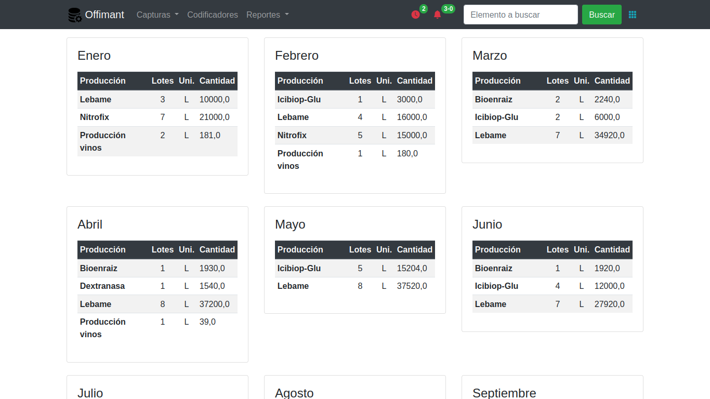
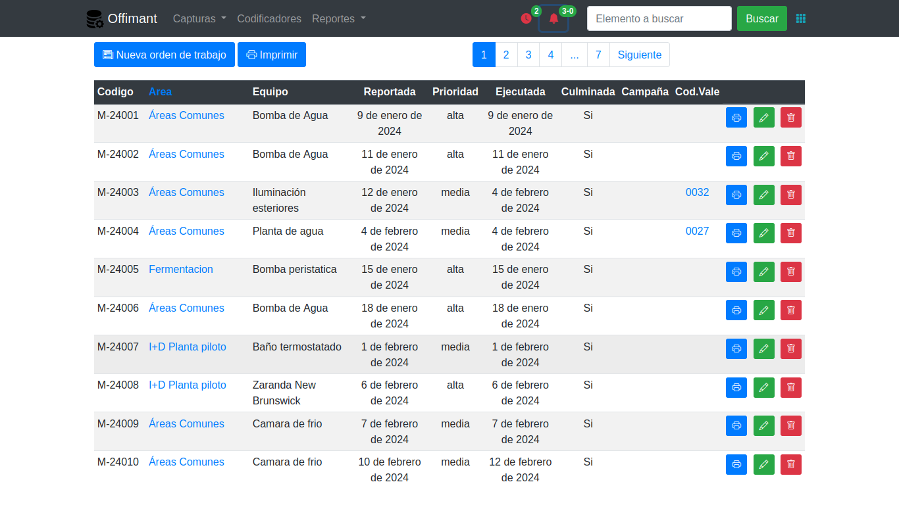
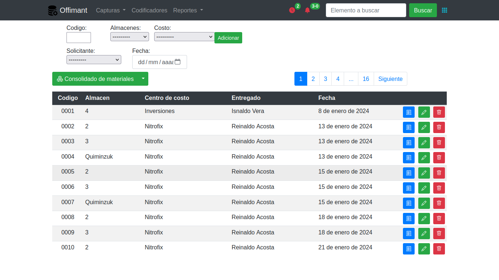

Sistema para el control:

- Materiales.
- Producciones.
- Ordenes de trabajo para mantenimiento.
- Plan anual de mantenimiento y cumplimiento de las tareas.
- Control del tiempo perdido industrial.

Diseñado en Django, JavaScritp como Backend y boostrap 4 en su frontend

